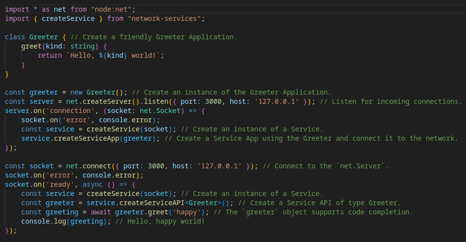

# *Network⬄Services*
A type-safe asynchronous RPC Service facility for connecting your app to the network.

## Introduction
*Network-Services* provides a simple and intuitive toolkit that makes connecting your app to the network *easy*.  You can use *Network-Services* to transform your application into a network connected [Service App](#service-app).  You can connect to your Service App from the same process or another process and call methods on it using a type-safe [Service API](#service-api).  You can optionally use a [Service Pool](#service-pool) to scale your Service App.

A *Network-Services* app can be explained with a complete and simple example.  In the "Hello, world!" example shown below, a Greeter Service App is hosted on 127.0.0.1:3000 and its `greeter.greet` method is called over a `net.Socket` using a Service API of type `Greeter`.



### Features
- Type-safe APIs: *code completion*, *parameter types*, and *return types*.
- Easily scale your Service App using a [Service Pool](#scaling).
- Return values *and* Errors are [marshalled](#marshalling) back to the caller.
- Infinite [property nesting](#use-network-services-to-create-an-api-with-a-nested-method-example); you can use a Service API to call *nested* properties on a Service App at any depth.
- [Bi-directional](#use-network-services-to-create-bi-directional-type-safe-apis-example) asynchronous RPC over TCP.
- [Security](#security) can be implemented using the native Node [TLS module](https://nodejs.org/docs/latest-v20.x/api/tls.html) (i.e., TLS and Client Certificate Authentication).
- A configurable [message protocol](#message-protocol). You can marshal your messages however you choose (e.g., JSON, binary, etc.), or use the default *minimalist* JSON message protocol.
- [Extend](#extend-network-services) *Network-Services* using the native `stream.Duplex` interface.

## Table of Contents
- [Installation](#installation)
- [Concepts](#concepts)
    - [Service](#service)
    - [Service App](#service-app)
    - [Service API](#service-api)
    - [Service Pool](#service-pool)
- [Usage](#usage)
    - [How to create a "Hello, World!" Greeter Service.](#how-to-create-a-hello-world-greeter-service)
- [Examples](#examples)
    - [*An instance of "Hello, World!"*](#an-instance-of-hello-world-typescript)
    - [*Use Network-Services to create bi-directional type safe APIs.*](#use-network-services-to-create-bi-directional-type-safe-apis-typescript)
    - [*Use Network-Services with TLS Encryption and Client Certificate Authentication.*](#use-network-services-with-tls-encryption-and-client-certificate-authentication-typescript)
    - [*Use Network-Services to create an API with a nested method.*](#use-network-services-to-create-an-api-with-a-nested-method-typescript)
    - [*Use Network-Services to scale a "Hello, World!" Greeter Service using a Service Pool.*](#use-network-services-to-scale-a-hello-world-greeter-service-using-a-service-pool-typescript)
- [API](#api)
- [Type Safety](#type-safety)
- [Extend *Network-Services*](#extend-network-services)
- [Scaling](#scaling)
- [Message Protocol](#message-protocol)
    - [Default JSON Message Protocol](#default-json-message-protocol)
- [Security](#security)
    - [Use TLS encryption.](#use-tls-encryption)
    - [Use TLS client certificate authentication.](#use-tls-client-certificate-authentication)
    - [Restrict API calls at runtime.](#restrict-api-calls-at-runtime)
    - [Specify an `ingressQueueSizeLimit` and `egressQueueSizeLimit` in the Service options.](#specify-an-ingressqueuesizelimit-and-egressqueuesizelimit-in-the-service-options)
- [Best Practices](#best-practices)
    - [Create a TypeScript interface for your Service API.](#create-a-typescript-interface-for-your-service-api)
    - [Set a timeout in `ServiceAPIOptions`.](#set-a-timeout-in-serviceapioptions)
    - [Impose property path restrictions.](#impose-property-path-restrictions)
    - [Ensure your `stream.Duplex` (e.g., a `net.Socket`) is *ready* for use.](#ensure-your-streamduplex-eg-a-netsocket-is-ready-for-use)
    - [If you create a stream (e.g., a `net.Socket`), set an `error` handler on it.](#if-you-create-a-stream-eg-a-netsocket-set-an-error-handler-on-it)
    - [Close and dereference streams in order to prevent memory leaks.](#close-and-dereference-streams-in-order-to-prevent-memory-leaks)
- [Test](#test)
## Installation
```bash
npm install network-services
```

## Concepts

*Network-Services* features an intuitive API that can be most easily understood by looking at an [example](#examples) or common [usage](#usage).  There are four important concepts that comprise the API, a [Service](#service), a [Service App](#service-app), a [Service API](#service-api), and a utility [Service Pool](#service-pool) implementation.

### Service

A Service instance coordinates bi-directional communication over a `stream.Duplex` (e.g., a `net.Socket`).  Once a Service is instantiated it can be used in order to create a [Service App](#service-app) or a [Service API](#service-api).  You can create a Service using the `createService` helper function.

### Service App

A Service App is a user defined object instance (i.e., an instance of your application) that is connected to a Service API over a `stream.Duplex` (e.g., a `net.Socket`).  You can use the `service.createServiceApp<T>` helper function, with your app as its argument, in order to create a Service App.  Once a Service App is instantiated, its methods can be called using a Service API instantiated in the same or different process.

### Service API

A Service API is a type safe representation of your remote Service App.  You can create a Service API using the `service.createServiceAPI<T>` helper function.  `service.createServiceAPI<T>` will return a Proxy that is type cast in order to make the methods that comprise `<T>` suitable for making asynchronous function calls.  You can call methods on the Service API object much how you would call methods on an instance of `<T>` itself.

### Service Pool

A Service Pool is an optional utility feature that facilitates scaling Service Apps using Worker threads. The Service Pool implementation is just one of many [scaling](#scaling) models that could be used in order to scale a *Network-Services* app.  You can create a Service Pool using the `network-services.createServicePool` helper function.  Because a pool of Service Apps may be shared by many Service API clients (i.e., a many-to-many relationship), the Service Pool implementation is limited to request-response messaging; a request (i.e., a method call) is made using a Service API and the response (i.e., the return value) from the Service App is returned to the caller.  However, a more sophisticated implementation could support coordinated bi-directional communication between many Service API clients and a pool of Service Apps. 

Please see the [Scalable "Hello, World!"](https://github.com/faranalytics/network-services/tree/main/examples/scalable_hello_world) example for a working implementation using a Service Pool.

## Usage

Using *Network-Services* involves creating a Service App and calling its methods over a stream (e.g., a `net.Socket`) using a Service API.  In this example you will create a `Greeter` Service and call its `greeter.greet` method over a `net.Socket` using an asynchronous Service API of type `Greeter`.

### How to create a "Hello, World!" Greeter Service.

#### Import the `node:net` module and the `createService` helper function.
```ts
import * as net from "node:net";
import { createService } from "network-services";
```

#### Create a Greeter Application.
```ts
class Greeter {
    greet(kind: string) {
        return `Hello, ${kind} world!`;
    }
}
const greeter = new Greeter();
```

#### Create a Server and create a Greeter Service App that is connected to the network.
```ts
const server = net.createServer().listen({ port: 3000, host: '127.0.0.1' });
server.on('connection', (socket: net.Socket) => {
    const service = createService(socket);
    service.createServiceApp(greeter); // The greeter.greet method can now be called over the `net.Socket` using a Service API.
});
```

#### Connect to the Server and create a Service API of type `Greeter`.
##### Use the `greeter` Service API in order to call the remote Service App's methods and log the greeting.
```ts
const socket = net.connect({ port: 3000, host: '127.0.0.1' });
socket.on('ready', async () => {
    const service = createService(socket);
    const greeter = service.createServiceAPI<Greeter>(); // Create a Service API of type Greeter.
    const greeting = await greeter.greet('happy'); 
    //                            ^
    // The `greeter` object facilitates code completion, parameter types and return types.
    console.log(greeting); // Hello, happy world!
});
```
Please see the ["Hello, World!"](https://github.com/faranalytics/network-services/tree/main/examples/hello_world) example for a working implementation.  For a scalable implementation, please see the [Scalable "Hello, World!"](https://github.com/faranalytics/network-services/tree/main/examples/scalable_hello_world) example.

> In the ["Hello, World!"](https://github.com/faranalytics/network-services/tree/main/examples/hello_world) example communication is uni-directional (i.e., it supports request-response messaging).  Please see the [Bi-directional Type Safe APIs](#use-network-services-to-create-bi-directional-type-safe-apis-example) example for how to implement bi-directional communication.

## Examples

### *An instance of "Hello, World!"* <sup><sup>\</TypeScript\></sup></sup>
Please see the [Usage](#usage) section above or the ["Hello, World!"](https://github.com/faranalytics/network-services/tree/main/examples/hello_world) example for a working implementation.

### *Use Network-Services to create bi-directional type safe APIs.* <sup><sup>\</TypeScript\></sup></sup>
Please see the [Bi-directional Type Safe APIs](https://github.com/faranalytics/network-services/tree/main/examples/bi-directional_type_safe_apis) example for a working implementation.

### *Use Network-Services with TLS Encryption and Client Certificate Authentication.* <sup><sup>\</TypeScript\></sup></sup>
Please see the [TLS Encryption and Client Authentication](https://github.com/faranalytics/network-services/tree/main/examples/tls_encryption_and_client_auth) example for a working implementation.

### *Use Network-Services to create an API with a nested method.* <sup><sup>\</TypeScript\></sup></sup>
Please see the [Nested Method](https://github.com/faranalytics/network-services/tree/main/examples/nested_method) example for a working implementation.

### *Use Network-Services to scale a "Hello, World!" Greeter Service using a Service Pool.* <sup><sup>\</TypeScript\></sup></sup>
Please see the [Scalable "Hello, World!"](https://github.com/faranalytics/network-services/tree/main/examples/scalable_hello_world) example for a working implementation.

## API

### network-services.createService(stream, options)
- `stream` `<stream.Duplex>` A `stream.Duplex` (e.g., a `net.Socket`).  The `stream.Duplex` will be used for bi-directional communication between Service Apps and Service APIs.
- `options` `<ServiceOptions & MuxOptions>`
    - `ingressQueueSizeLimit` `<number>` An optional ingress buffer size limit in bytes.  This argument specifies the limit on buffered data that may accumulate from calls *from* the remote Service API and return values *from* the remote Service App.  If the size of the ingress buffer exceeds this value, the stream will emit a `QueueSizeLimitError` and close.  **Default:** `undefined` (i.e., no limit).
    - `egressQueueSizeLimit` `<number>` An optional egress buffer size limit in bytes.  This argument specifies the limit on buffered data that may accumulate from calls *to* the remote Service App and return values *to* the remote Service API. If the size of the egress buffer exceeds this value, a `QueueSizeLimitError` will be thrown and the stream will close.  **Default:** `undefined` (i.e., no limit).
    - `muxClass` `<MuxConstructor>` An optional `Mux` implementation.  Messages are muxed as they enter and leave the `stream.Duplex`.  You can use one of the default muxers or provide a custom implementation.  For example, you can extend the default `network-services.BufferMux` and override the `serializeMessage` and `deserializeMessage` methods in order to implement a custom [message protocol](#message-protocol) (e.g., a binary message protocol).  If a custom `Mux` implementation is not provided here, *Network-Services* will provide a default `Mux` implementation compatible with the underlying `stream.Duplex`.  Default muxers respect back-pressure.  **Default:**  a `BufferMux` or an `ObjectMux` for streams in object mode.
- Returns: `<Service>`

### service.createServiceApp\<T\>(app, options)
- `app` `<object>` An instance of your application.
- `options` `<ServiceAppOptions<T>>`
    - `paths` `<Array<PropPath<Async<T>>>>` An `Array` of *property paths* (i.e., dot-path `string`s).  *If defined*, only property paths in this list may be called on the Service App. Each element of the array is a `PropPath` and a `PropPath` is simply a dot-path `string` representation of a property path.  Please see the [Nested Method](https://github.com/faranalytics/network-services/tree/main/examples/nested_method) example for a working implementation.  **Default:** `undefined`.
- Returns: `<ServiceApp<T>>`

### service.createServiceAPI\<T\>(options)
- `options` `<ServiceAPIOptions>`
    - `timeout` `<number>` Optional argument in milliseconds that specifies the `timeout` for function calls. **Default:** `undefined` (i.e., no timeout).
    - `identifierGenerator` `<IdentifierGenerator>` An optional instance of a class that implements the `network-services.IdentifierGenerator` interface.  This class instance will be used in order to generate a unique identifier for each API call.  The default `network-services.NumericIdentifierGenerator` will work for the common case; however, a more robust solution may be required for certain custom implementations. **Default:** `network-services.NumericIdentifierGenerator`
- Returns: `<Async<T>>` A type cast `Proxy` object of type `<Async<T>>` that consists of asynchronous analogues of methods in `<T>`.

> The `service.createServiceAPI<T>` helper function returns a JavaScript `Proxy` object cast to type `<Async<T>>`.  `service.createServiceAPI<T>` filters and transforms the function types that comprise `<T>` into their asynchronous analogues i.e., if a function type isn't already defined as returning a `Promise`, it will be transformed to return a `Promise` - otherwise its return type will be left unchanged.  This transformation is necessary because all function calls over a `stream.Duplex` (e.g., a `net.Socket`) are asynchronous.  Please see the [Bi-directional Type Safe APIs](#use-network-services-to-create-bi-directional-type-safe-apis-example) example for how to easily consume a `<Async<T>>` in your application.

#### The following Errors may arise when a Service API method is called:
- Errors:
  - If the remote Service App method throws an `Error`, the `Error` will be marshalled back from the Service and the `Promise` will reject with the `Error` as its reason.
  - If a call exceeds the `egressQueueSizeLimit`, the `Promise` will reject with `QueueSizeLimitError` as its reason and the stream will close.
  - If an `error` event occurs on the `stream.Duplex`, the `Promise` will reject with the given reason.
  - If the `stream.Duplex` closes, the `Promise` will reject with `StreamClosedError` as its reason.
  - If the `paths` array is defined in the remote `ServiceAppOptions<T>` and a method is called that is not a registered property path, the `Promise` will reject with `PropertyPathError` as its reason.
  - If a property is invoked that is not a function on the remote Service App, the `Promise` will reject with `TypeError` as its reason.
  - If the call fails to resolve or reject prior to the `timeout` specified in `ServiceAPIOptions`, the `Promise` will reject with `CallTimeoutError` as its reason.

> ***NB*** The Service API and type safety is not enforced at runtime.  Please see the `paths` property of the `ServiceAppOptions<T>` object for runtime checks.

### network-services.createServicePool(options)
- `options` `<ServicePoolOptions>`
    - `workerCount` `<number>` Optional argument that specifies the number of worker threads to be spawned.
    - `workerURL` `<string | URL>`  The URL or path to the `.js` module file. This is the module that will be scaled according to the value specified for `workerCount`.
    - `restartWorkerOnError` `<boolean>` A boolean setting specifying if Workers should be restarted on `error`. **Default**: `false`
    - `workerOptions` `<worker_threads.WorkerOptions>` Optional `worker_threads.WorkerOptions` to be passed to each Worker instance.
- Returns: `<ServicePool>`

### network-services.createPortStream(port, options)
- `port` `<worker_threads.MessagePort | worker_threads.Worker>` An optional `MessagePort` to be wrapped by a `stream.Duplex`. **Default**: `worker_threads.parentPort`
- `options` `<internal.DuplexOptions>` An optional `internal.DuplexOptions` object to be passed to the `PortStream` parent class.
- Returns: `<PortStream>`

A `PortStream` defaults to wrapping the `parentPort` of the Worker thread into a `stream.Duplex`.  Hence, a `PortStream` *is a* `stream.Duplex`, so it can be passed to the *Network-Services* `createService` helper function.  This is the stream adapter that is used in the Worker modules that comprise a Service Pool.

## Type Safety
*Network-Services* provides a facility for building a type safe network API.  The type safe API facility is realized through use of JavaScript's Proxy object and TypeScript's type variables. A Proxy interface is created by passing your app's public interface to the type parameter of the `service.createServiceAPI<T>` helper function.  The type safe Proxy interface facilitates *code completion*, *parameter types*, and *return types*; it helps safeguard the integrity of your API.  

Please see the [Bi-directional Type Safe APIs](#use-network-services-to-create-bi-directional-type-safe-apis-example) example for a working implementation.

## Extend *Network-Services*
*Network-Services* is modeled around communication over `net.Sockets`; however, it can be used in order to communicate over any resource that implements the `stream.Duplex` interface.  This means that if you can model your bi-directional resource as a `stream.Duplex`, it should work with *Network-Services*.  The `createService` helper function takes a `stream.Duplex` as its first argument.  Just implement a [stream.Duplex](https://nodejs.org/api/stream.html#implementing-a-duplex-stream) around your resource and pass it into the `createService` helper function.

The [*Scalability*](https://github.com/faranalytics/scalability) package, for example, uses *Network-Services* in order to scale an arbitrary Service App using Worker threads.

## Scaling
*Network-Services* is architected in order to support a variety of scaling models.  The model implemented by the utility [Service Pool](#service-pool) facility, which supports request-response messaging, is just one of many possible approaches to scaling an application built on *Network-Services*.  

For example, a Service Pool implementation where there is a one-to-one relationship between Service APIs and Service Apps would facilitate bi-directional communication.  An alternative approach may be to run multiple servers in separate processes or Worker threads, connect to each of them, and round-robin through the respective Service APIs.  Likewise, a container orchestration framework could be used in order to easily scale a *Network-Services* app.

Complexities arise when muxing many-to-many relationships; hence, please see the simple and capable [`ServicePool`](https://github.com/faranalytics/network-services/blob/main/src/service_pool.ts) implementation for relevant considerations if you wish to draft a custom implementation. 

Please see the [Scalable "Hello, World!"](https://github.com/faranalytics/network-services/tree/main/examples/scalable_hello_world) example for a working scalable Service implementation using a Service Pool.

## Message Protocol
*Network-Services* provides a default *minimalist* JSON message protocol.  However, you can marshal your messages however you choose by extending the `BufferMux` class and implementing the`serializeMessage` and `deserializeMessage` methods.  Simply pass your custom `Mux` implementation in the `ServiceOptions` when you create your Service.  Please see the `muxClass` parameter in `ServiceOptions` of the [createService](#network-servicescreateservicestream-options) helper function.

### Default JSON Message Protocol
*Network-Services* provides a concise default JSON message protocol.  The message protocol is guided by parsimony; it includes just what is needed to make a function call and return a result or throw an `Error`.

#### Marshalling
Arguments, return values, and Errors are serialized using JavaScript's `JSON.stringify`.  The choice of using `JSON.stringify` has important and *certain* ramifications that should be understood.  Please see the rules for [serialization](https://developer.mozilla.org/en-US/docs/Web/JavaScript/Reference/Global_Objects/JSON/stringify#description).

#### Type Definitions
The type definitions for the default JSON message protocol:

##### The Call Message
A `CallMessageList` consists of a numeric message type, the call identifier, the property path to the called function, and its arguments.
```ts
type CallMessageList = [
    0, // The message type; 0 = Call.
    string, // The call identifier.
    Array<string>, // The elements of the property path to the called method.
    ...Array<unknown> // The arguments to be passed to the function.
];
```
##### The Result Message
A `ResultMessageList` consists of a numeric message type, the call identifier, and a return value or `Error`.
```ts
type ResultMessageList = [
    1 | 2, // The message type; 1 = Error, 2 = Result.
    string, // The call identifier.
    unknown // The return value or Error.
];
```

## Security
Security is a complex and multifaceted endeavor.

### Use TLS encryption.
TLS Encryption may be implemented using native Node.js [TLS Encryption](https://nodejs.org/docs/latest-v20.x/api/tls.html).  Please see the [TLS Encryption and Client Authentication](https://github.com/faranalytics/network-services/tree/main/examples/tls_encryption_and_client_auth) example for a working implementation.

### Use TLS client certificate authentication.
TLS Client Certificate Authentication may be implemented using native Node.js [TLS Client Authentication](https://nodejs.org/docs/latest-v20.x/api/tls.html).  Please see the [TLS Encryption and Client Authentication](https://github.com/faranalytics/network-services/tree/main/examples/tls_encryption_and_client_auth) example for a working implementation.

### Restrict API calls at runtime.
The Service API and type safety are not enforced at runtime. You can restrict API calls to specified Service App methods by providing an `Array` of property paths to the `paths` property of the `ServiceAppOptions<T>` object.  If the `paths` array is defined in `ServiceAppOptions<T>` and a method is called that is not a registered property path, the awaited `Promise` will reject with `PropertyPathError` as its reason.

### Specify an `ingressQueueSizeLimit` and `egressQueueSizeLimit` in the Service options.
*Network-Services* respects backpressure; however, it is advisable to specify how much data may be buffered in order to ensure your *application* can respond to adverse network phenomena.  If the stream peer reads data at a rate that is slower than the rate that data is written to the stream, data may buffer until memory is exhausted.  This is a [vulnerability](https://nodejs.org/api/stream.html#writablewritechunk-encoding-callback) that is inherent in streams, which can be mitigated by preventing internal buffers from growing too large.  

You can specify a hard limit on ingress and egress buffers in the Service `options`. `ingressQueueSizeLimit` specifies a limit on incoming data i.e., data returned *from* the remote Service App or calls *from* the remote Service API. `egressQueueSizeLimit` specifies a limit on outgoing data i.e., data returned *to* the remote Service API or calls *to* the remote Service App.  If an ingress or egress buffer exceeds the specified limit, *the respective stream will error and close*.  *Network-Services* will immediately tear down its internal buffers in order to free memory - [dereference the stream](#close-and-dereference-streams-in-order-to-prevent-memory-leaks), and GC will sweep.  

## Best Practices

### Create a TypeScript interface for your Service API.
You can pass your application's class as a type variable argument to the `service.createServiceAPI<T>` helper function; *however, it's advisable to define a public interface instead*.  You can publish your public interface to be consumed separately or export it from your application.

For example, for the `Greeter` class in the "Hello, World!" example, the interface:

```ts
interface IGreeter {
    greet(kind: string): string
}
```

### Set a timeout in `ServiceAPIOptions`.
Calling a method on a remote Service App using a Service API may take too long to resolve or reject - or may never resolve at all.  This effect can be caused by a long running operation in the remote Service App or a congested network.  If the call fails to resolve or reject prior to the `timeout` specified in `ServiceAPIOptions`, the `Promise` will reject with `CallTimeoutError` as its reason.

### Impose property path restrictions.
Unless you control the definition of both the Service API and the Service App, you should specify which methods may be called on your Service App using the `paths` property of `ServiceAppOptions<T>`.

### Ensure your `stream.Duplex` (e.g., a `net.Socket`) is [*ready*](https://nodejs.org/api/net.html#event-ready) for use.
*Network-Services* assumes that the `stream.Duplex` passed to `createService` is [*ready*](https://nodejs.org/api/net.html#event-ready) to use; this assumption and separation of concern is an intentional design decision.  A `stream.Duplex` implementation (e.g., a `net.Socket`) *may* include an event (e.g., something like `'ready'` or `'connect'`) that will indicate it is ready for use.  Please await this event, if available, prior to passing the `stream.Duplex` to the `createService` helper function.

### If you create a stream (e.g., a `net.Socket`), set an `error` handler on it.
A `stream.Duplex` may error even before becoming *ready*; hence, as usual, you should *synchronously* set an error handler on a new stream instance.

### Close and dereference streams in order to prevent memory leaks.
The object graph of a Service instance is rooted on its stream.  It will begin decomposition immediately upon stream closure.  However, in order to fully dispose of a Service instance, simply destroy and dereference its stream; GC will sweep buffers and other liminal resources.

## Test

### Install dependencies.
```bash
npm install && npm update
```
### Run tests.
```bash
npm test
```